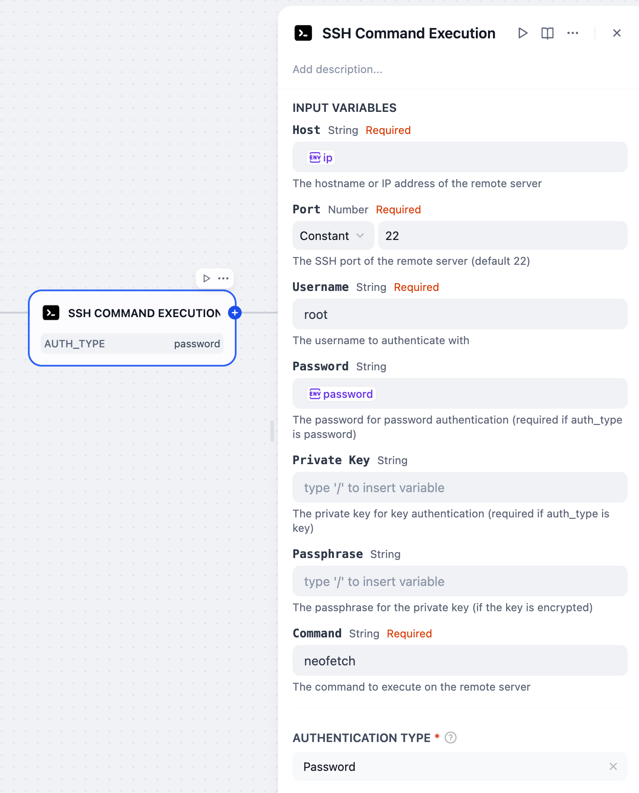
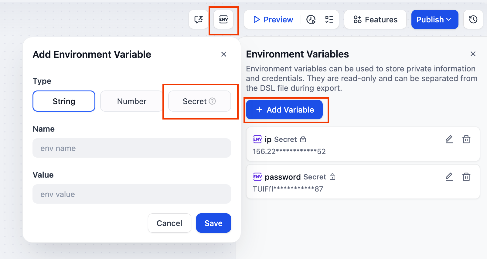

# SSH Command Execution Plugin

**Author:** [Steven Lynn](https://github.com/stvlynn)
**Version:** 0.0.1
**Type:** tool

## Description

The SSH Command Execution Plugin allows users to execute commands on remote servers via SSH protocol. It supports both password and private key authentication methods.


> Don't know where to start? Try this [DSL Template](https://raw.githubusercontent.com/stvlynn/SSH-Dify-Plugin/refs/heads/main/example.yml) !

## Features

- Supports password and private key authentication
- Executes remote commands and returns standard output and standard error
- Securely handles connection and authentication errors

## Parameters

| Parameter | Type | Required | Description |
|-----------|------|----------|-------------|
| host | string | Yes | Hostname or IP address of the remote server |
| port | number | Yes | SSH port, default is 22 |
| username | string | Yes | Username for authentication |
| auth_type | select | Yes | Authentication type: password or key |
| password | string | Conditional | Password for password authentication (required if auth_type is password) |
| private_key | string | Conditional | Private key content for key authentication (required if auth_type is key) |
| passphrase | string | No | Passphrase for the private key (if the key is encrypted) |
| command | string | Yes | Command to execute on the remote server |

## Safety Tip

Keep your instance IP and password safe in **Environment Varriable -> secret**!



## Input and Output Example

### Input:
```json
{
  "private_key": "",
  "passphrase": "",
  "host": "192.************1",
  "port": "22",
  "username": "root",
  "auth_type": "password",
  "password": "T************87",
  "command": "neofetch"
}
```

### Output:
```json
{
  "text": "",
  "files": [],
  "json": [
    {
      "stderr": "",
      "stdout": "***some output***",
      "success": true
    }
  ]
}
```

## Security Considerations

- Ensure you have permission to access the target server
- Sensitive information such as private keys and passwords should be kept secure
- Follow the principle of least privilege, granting only necessary execution permissions

## License

[MIT](./LICENSE)


